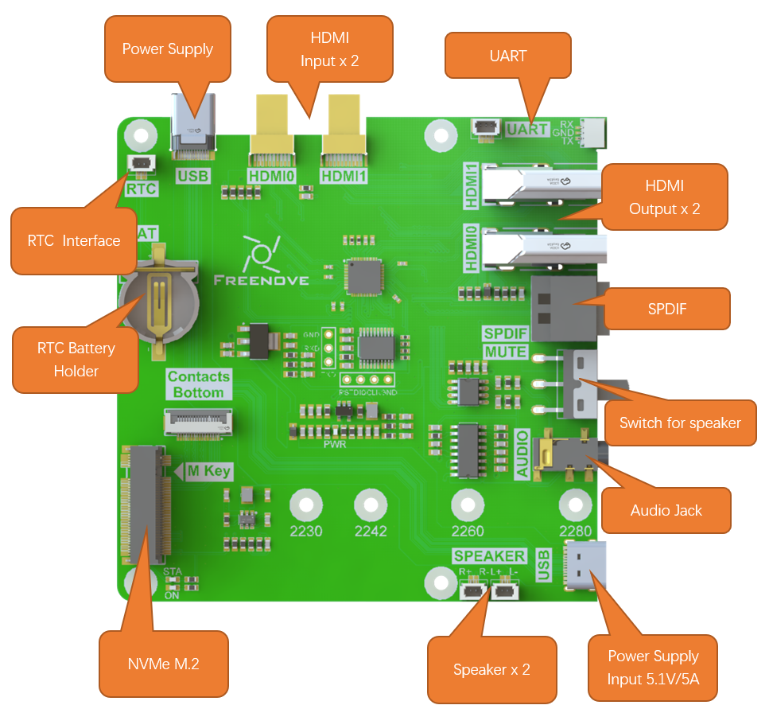
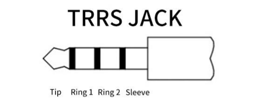
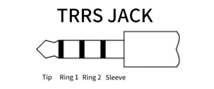
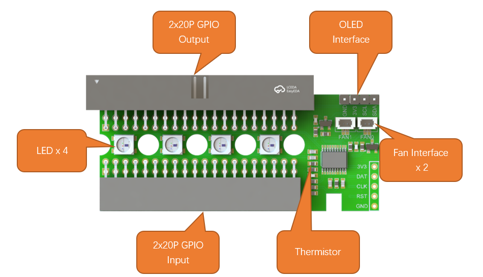
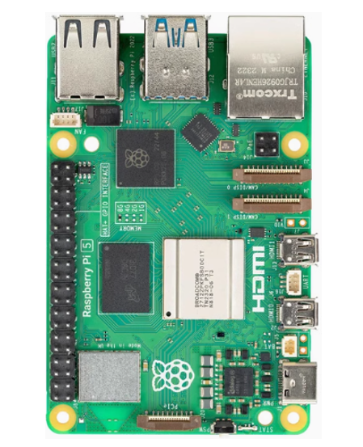
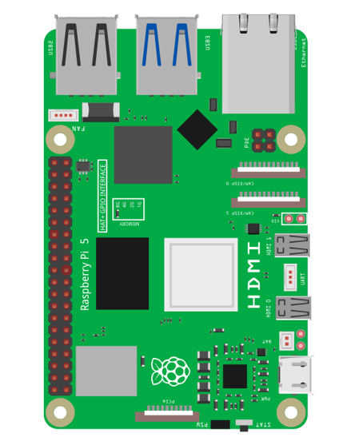
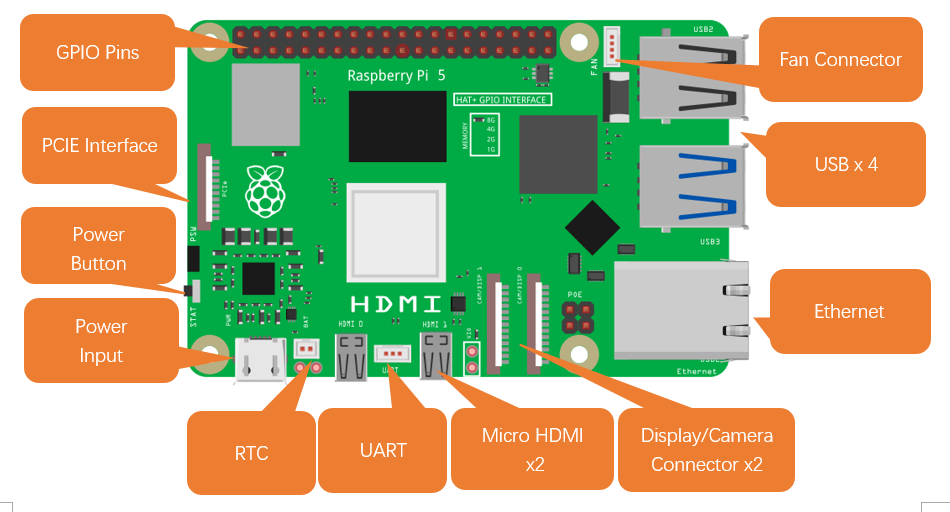
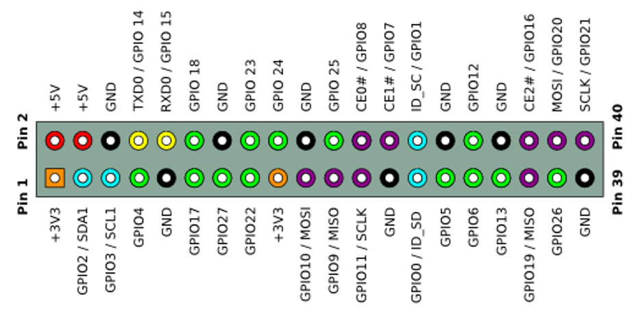

##############################################################################
Chapter 1 Main Components of the Computer Case
##############################################################################

In this chapter, we will mainly introduce the main components of this case and their functionalities.

1.1 Introduction to Freenove Case Adapter for Raspberry Pi
******************************************************************

Hereinafter we will refer to this component as Case Adapter Board.

The Case Adapter Board is specifically designed for the Raspberry Pi 5 interface, with the goal of transforming the Rpi 5 into a fully functional home computer. This board incorporates a variety of essential interfaces, including a Type-C interface, two HDMI interfaces, an audio output interface, a speaker interface, an M.2 M-Key interface, and an RTC interface.

In the RPi 5 design, the traditional 3.5mm audio output interface has been removed, and audio signals are now solely output through HDMI. To address this, we have developed an audio separation circuit on the Case Adapter Board. This circuit enables audio to be output via the 3.5mm audio interface on the board, You can use the external 3.5mm TRS headphone jack on the Raspberry Pi 5 to listen to audio output. For proper functionality, ensure your headphone connector is compatible. Below is an explanation of common jack types:

.. table::
    :align: center

    +----------+---------------+--------+---------------+
    | |Chapter1_01|            | Tip    | Left Channel  |
    |                          +--------+---------------+
    |                          | Ring   | Right Channel |
    |                          +--------+---------------+
    |                          | Sleeve | GND           |
    +----------+---------------+--------+---------------+
    | **OMTP** | |Chapter1_02| | Tip    | Left Channel  |
    |          |               +--------+---------------+
    |          |               | Ring1  | Right Channel |
    |          |               +--------+---------------+
    |          |               | Ring2  | MIC           |
    |          |               +--------+---------------+
    |          |               | Sleeve | GND           |
    +----------+---------------+--------+---------------+
    | **CTIA** | |Chapter1_03| | Tip    | Left Channel  |
    |          |               +--------+---------------+
    |          |               | Ring1  | Right Channel |
    |          |               +--------+---------------+
    |          |               | Ring2  | GND           |
    |          |               +--------+---------------+
    |          |               | Sleeve | MIC           |
    +----------+---------------+--------+---------------+

Additionally, we have designed an audio amplification circuit. With this circuit, you can control two speakers, each with an impedance of 4Ω and a power rating of 3W. If you prefer not to utilize the speakers within the computer case, you can easily switch them on or off using the MUTE button. For those who have high-fidelity demands, we also offer an SPDIF interface. This allows you to connect your own device for audio playback, ensuring superior sound quality.

The Case Adapter Board also features a conversion function that transforms the RPi 5's PCIe interface into an M.2 M-Key interface. This conversion provides great convenience when it comes to using NVME SSDs. It supports four different sizes of SSDs, namely 2230, 2242, 2260, and 2280. Important Note: Only the FNK0100B and FNK0100K models include an NVMe SSD. If you purchase any other model, you will need to buy a compatible SSD separately.

To enhance the accuracy of the Raspberry Pi's clock, it is advisable to add a battery to the RTC. For this purpose, we have installed a battery holder on the board. If you decide to add a battery, we recommend either purchasing a rechargeable lithium-manganese button-cell battery (with dimensions of 1220 and a voltage of 3V) or an official battery.

https://www.raspberrypi.com/documentation/computers/raspberry-pi.html#real-time-clock-rtc。

:red:`Due to the addition of the audio separation function, there is an increase in power consumption. Only the official 5.1V/5A power adapter (or compatible versions) can be used.`

1.2 Introduction to Freenove Case GPIO Adapter for Raspberry Pi
******************************************************************

Hereinafter we will refer to this component as GPIO Board.

The GPIO board extends the GPIO pins of the Raspberry Pi 5 to the outside of the case. Additionally, it integrates color lights, case fans, and OLED interface, which can be controlled via the IIC of the RPi 5.

The following table shows the power consumption of the GPIO Board.

.. table::
    :class: freenove-ow

    +----------+----------------+------------------+
    | Function | Supply Voltage | Electric current |
    +==========+================+==================+
    | LED      | 5V             | 40*4mA           |
    +----------+----------------+------------------+
    | Fan      | 3.3V           | 130mA            |
    +----------+----------------+------------------+
    | OLED     | 3.3V           | 22mA             |
    +----------+----------------+------------------+

1.3 Introduction to Raspberry Pi 5 (RPi 5)
*******************************************************

At the time of this writing, this product only supports RPi5. The following shows the physical and model figures of an RPi 5.

.. table::
    :align: center
    :class: table-line
    :width: 90%

    +-----------------------------------------+----------------------------------+
    | Practicality picture of Raspberry Pi 5: | Model diagram of Raspberry Pi 5: |
    |                                         |                                  |
    | |Chapter01_05|                          | |Chapter01_06|                   |
    +-----------------------------------------+----------------------------------+

Hardware interface diagram of RPi 5 is shown below: 

GPIO
====================================

GPIO: General purpose input/output. We will introduce the specific feature of the pins on the Raspberry Pi and how you can utilize them in all sorts of ways in your projects. Most RPi Module pins can be used as either an input or output, depending on your program and its functions. When programming the GPIO pins, there are three different ways to reference them: GPIO numbering, physical numbering, WiringPi GPIO Numbering.

BCM GPIO Numbering
====================================

The Raspberry Pi CPU uses Broadcom (BCM) processing chips BCM2835, BCM2836 or BCM2837. GPIO pin numbers are assigned by the processing chip manufacturer and are how the computer recognizes each pin. The pin numbers themselves do not make sense or have meaning, as they are only a form of identification. Since their numeric values and physical locations have no specific order, there is no way to remember them, so you will need to have a printed reference or a reference board that fits over the pins. 

Each pin is defined as below:

For more details about pin definition of GPIO, please refer to https://pinout.xyz/

Power requirements of various versions of Raspberry Pi are shown in following table:

.. table::
    :class: freenove-ow

    +-------------------------+----------------------------------+----------------------------------------------------+-----------------------------------------------+
    | Product                 | Recommended PSU current capacity | Maximum total USB peripheral current draw          | Typical bare-board active current consumption |
    +=========================+==================================+====================================================+===============================================+
    | Raspberry Pi Model A    | 700mA                            | 500mA                                              | 200mA                                         |
    +-------------------------+----------------------------------+----------------------------------------------------+-----------------------------------------------+
    | Raspberry Pi Model B    | 1.2A                             | 500mA                                              | 500mA                                         |
    +-------------------------+----------------------------------+----------------------------------------------------+-----------------------------------------------+
    | Raspberry Pi Model A+   | 700mA                            | 500mA                                              | 180mA                                         |
    +-------------------------+----------------------------------+----------------------------------------------------+-----------------------------------------------+
    | Raspberry Pi Model B+   | 1.8A                             | 600mA/1.2A (switchable)                            | 330mA                                         |
    +-------------------------+----------------------------------+----------------------------------------------------+-----------------------------------------------+
    | Raspberry Pi 2 Model B  | 1.8A                             | 600mA/1.2A (switchable)                            | 350mA                                         |
    +-------------------------+----------------------------------+----------------------------------------------------+-----------------------------------------------+
    | Raspberry Pi 3 Model B  | 2.5A                             | 1.2A                                               | 400mA                                         |
    +-------------------------+----------------------------------+----------------------------------------------------+-----------------------------------------------+
    | Raspberry Pi 3 Model A+ | 2.5A                             | Limited by PSU, board, and connector ratings only. | 350mA                                         |
    +-------------------------+----------------------------------+----------------------------------------------------+-----------------------------------------------+
    | Raspberry Pi 3 Model B+ | 2.5A                             | 1.2A                                               | 500mA                                         |
    +-------------------------+----------------------------------+----------------------------------------------------+-----------------------------------------------+
    | Raspberry Pi 4 Model B  | 3.0A                             | 1.2A                                               | 600mA                                         |
    +-------------------------+----------------------------------+----------------------------------------------------+-----------------------------------------------+
    | Raspberry Pi 5 Model B  | 5.0A                             | 1.6A (600mA if using a 3A power supply)            | 800mA                                         |
    +-------------------------+----------------------------------+----------------------------------------------------+-----------------------------------------------+
    | Raspberry Pi Zero W     | 1.2A                             | Limited by PSU, board, and connector ratings only. | 150mA                                         |
    +-------------------------+----------------------------------+----------------------------------------------------+-----------------------------------------------+
    | Raspberry Pi Zero       | 1.2A                             | Limited by PSU, board, and connector ratings only  | 100mA                                         |
    +-------------------------+----------------------------------+----------------------------------------------------+-----------------------------------------------+

For more details, please refer to 

https://www.raspberrypi.com/documentation/computers/raspberry-pi.html#power-supply

In this product, the Raspberry Pi 5 is used and it must be powered by a 5.1V/5A power supply. Insufficient power may cause various functions to operate abnormally, or even permanently damage your Raspberry Pi 5. Therefore, we strongly recommend using a 5.1V/5A power supply to ensure optimal performance and avoid potential hardware failure