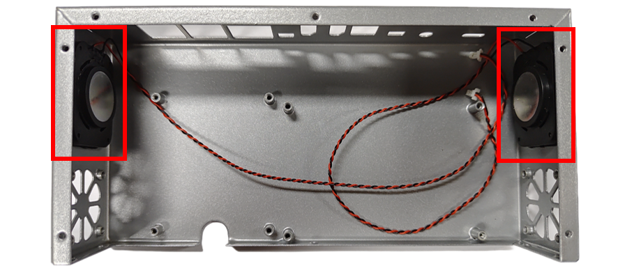
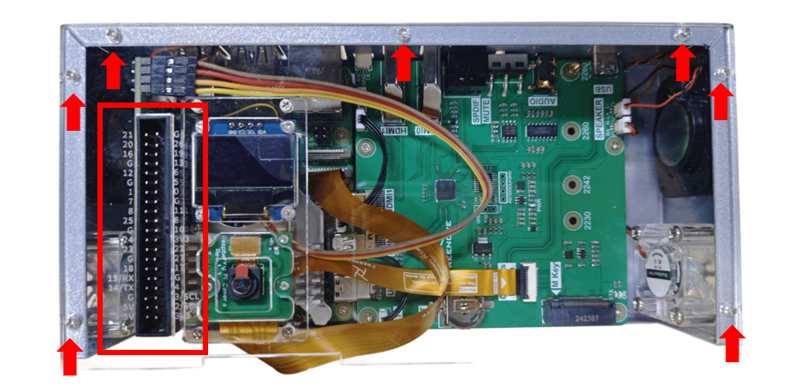
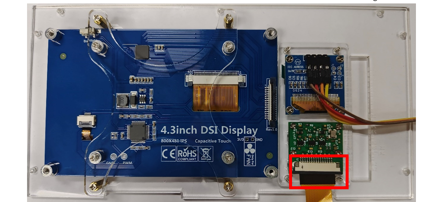
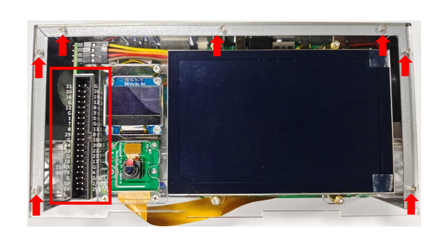

##############################################################################
Chapter 2 Assembly 
##############################################################################

**If you need any help, please feel free to contact us at** support@freenove.com

It is recommended to assemble and use the Freenove Computer Case for Raspberry Pi according to this tutorial. Otherwise, it may lead to incorrect device installation or damage. Please check all the parts again. If there are any incorrect or missing parts in your kit, please contact us in time.

**Please assemble the product when it is powered off.**

Step 1 Installation of Fans and Speakers
*************************************************

Installing the Speakers
====================================

+-------------------------------------------------------------------------------------------------------------------------------------------------------------------------------------------------------------------------------------------------------------------------------------+
| When installing the speakers, the rubber pad might interfere with the installation process.                                                                                                                                                                                         |
|                                                                                                                                                                                                                                                                                     |
| To address this, you can initially use four M2 x 4 Countersunk Head Screws to pre-drill the four mounting holes.                                                                                                                                                                    |
|                                                                                                                                                                                                                                                                                     |
| Once the holes are prepared, position the speaker inside the case.                                                                                                                                                                                                                  |
|                                                                                                                                                                                                                                                                                     |
| Afterward, secure the speaker from the exterior of the case using four M2 x 4 Countersunk Head Screws.                                                                                                                                                                              |
|                                                                                                                                                                                                                                                                                     |
| Ensure the rubber pads of the speaker is properly seated against the case.                                                                                                                                                                                                          |
|                                                                                                                                                                                                                                                                                     |
| :red:`(Keep the release liner on the speaker to facilitate its installation. Fasten the screws moderately to avoid contact between the diaphragm and case, which may cause unwanted noise. If screws are missing, peel off the film and secure the speaker with adhesive instead.)` |
|                                                                                                                                                                                                                                                                                     |
| |Chapter02_00|                                                                                                                                                                                                                                                                      |
|                                                                                                                                                                                                                                                                                     |
| |Chapter02_01|                                                                                                                                                                                                                                                                      |
+-------------------------------------------------------------------------------------------------------------------------------------------------------------------------------------------------------------------------------------------------------------------------------------+

Installing the Fans
==================================

+------------------------------------------------------------------------------------------------------------------------------------------------------------------+
| Use the M3 x 12 screws to secure the fans to the inside of the computer case.                                                                                    |
|                                                                                                                                                                  |
| Pay close attention to the assembly orientation of the fan as they should form an air duct (indicated by the red arrows), which shows the direction of airflow.  |
|                                                                                                                                                                  |
| The fan on the left side is responsible for blowing the hot air out of the computer case's interior, while the fan on the right side draws in cool air.          |
|                                                                                                                                                                  |
| |Chapter02_02|                                                                                                                                                   |
+------------------------------------------------------------------------------------------------------------------------------------------------------------------+

Step 2 Installing Rpi 5 and Case Adapter Board
******************************************************

Installing the NVMe SSD Securing Standoffs
======================================================

+----------------------------------------------------------------------------------------------------------------------------------------------------------------------------------------------+
| Install the brass standoffs for securing the NVMe SSD on the Case Adapter Board as illustrated below. Utilize M2.5x3 Screws to affix the M2.5x5 Brass Standoffs to the 2280 mounting holes.  |
|                                                                                                                                                                                              |
| Depending on the length of your NVMe SSD, please install them on the appropriate holes.                                                                                                      |
|                                                                                                                                                                                              |
| |Chapter02_03|                                                                                                                                                                               |
+----------------------------------------------------------------------------------------------------------------------------------------------------------------------------------------------+

Installing NVMe SSD
========================================

If you do not have an SSD, please skip to the :ref:`next step <Case_Adapter_Board>`.

+---------------------------------------------------------------------------------------------------------------------------------------+
| Insert the NVMe SSD diagonally into the M.2 interface, and use the M2.5x3 Screws to fix it onto the brass standoffs for the NVMe SSD. |
|                                                                                                                                       |
| |Chapter02_04|                                                                                                                        |
+---------------------------------------------------------------------------------------------------------------------------------------+

.. _Case_Adapter_Board:

Installing RPi 5 and Case Adapter Board
======================================================

+----------------------------------------------------------------------------------------------------------------------------------------------------------------------------------------------------------------------------------------------+
| Inserting the SD card to the SD card slot on the back of RPi 5.                                                                                                                                                                              |
|                                                                                                                                                                                                                                              |
| |Chapter02_05|                                                                                                                                                                                                                               |
+----------------------------------------------------------------------------------------------------------------------------------------------------------------------------------------------------------------------------------------------+
| Align the Type-C interface, HDMI0 interface, and HDMI1 interface of the RPi 5 precisely with the corresponding interfaces on the Case Adapter Board. Then, connect the two boards together. Please follow the arrow directions for assembly. |
|                                                                                                                                                                                                                                              |
| |Chapter02_06|                                                                                                                                                                                                                               |
|                                                                                                                                                                                                                                              |
| The following image shows the two boards after connection.                                                                                                                                                                                   |
|                                                                                                                                                                                                                                              |
| |Chapter02_07|                                                                                                                                                                                                                               |
+----------------------------------------------------------------------------------------------------------------------------------------------------------------------------------------------------------------------------------------------+

.. |Chapter02_06| image:: ../_static/imgs/2_Assembly_/Chapter02_06.png

Connecting Cables of RTC, UART and the Speakers
=======================================================

+----------------------------------------------------------------------------------------------------------------+
| Connect the RPi 5's BAT connector to the RTC connector of the Case Adapter Board with the SH-1.0mm-2P cable.   |
|                                                                                                                |
| |Chapter02_08|                                                                                                 |
+----------------------------------------------------------------------------------------------------------------+
| Connect the RPi 5's UART connector to the UART connector of the Case Adapter Board with the SH-1.0mm-3P cable. |
|                                                                                                                |
| |Chapter02_09|                                                                                                 |
+----------------------------------------------------------------------------------------------------------------+
| Connect the cables of the two speakers to the SPEAKER interface on the Case Adapter Board.                     |
|                                                                                                                |
| |Chapter02_10|                                                                                                 |
+----------------------------------------------------------------------------------------------------------------+

Assembly with the Case
=========================================

+--------------------------------------------------------------------------+
| Place the combined Raspberry Pi 5 and Case Adapter Board into the case.  |
|                                                                          |
| |Chapter02_11|                                                           |
+--------------------------------------------------------------------------+
| Fix them to the case with M2.5 x 5 Countersunk Head Screws.              |
|                                                                          |
| |Chapter02_12|                                                           |
+--------------------------------------------------------------------------+

Step 3 Connecting Cables
******************************

Connecting Cables
==============================

+-----------------------------------------------------------------------------------------------------------------------------------------+
| 1. Connecting the camera cable                                                                                                          |
|                                                                                                                                         |
| Connect the shorter end of the camera to the CAM/DISP 1 interface on the RPi 5.                                                         |
|                                                                                                                                         |
| Pay attention to the orientation of the contacts. (The red arrow below indicates the orientation of the contacts).                      |
|                                                                                                                                         |
| |Chapter02_13|                                                                                                                          |
|                                                                                                                                         |
| :red:`Caution: Although the Raspberry Pi camera cable and screen cable may look identical in appearance, they are NOT interchangeable.` |
+-----------------------------------------------------------------------------------------------------------------------------------------+
| 2. Connect the NVMe SSD cable                                                                                                           |
|                                                                                                                                         |
| Connect the cable for NVME SSD to the PCIe interface on the RPi 5.                                                                      |
|                                                                                                                                         |
| Pay attention to the orientation of the contacts (The red arrow below indicates the contacts orientation.)                              |
|                                                                                                                                         |
| Connect the other end of the cable to the FPC connector of the Case Adapter Board.                                                      |
|                                                                                                                                         |
| |Chapter02_14|                                                                                                                          |
+-----------------------------------------------------------------------------------------------------------------------------------------+
| 3. Connect the screen cable                                                                                                             |
|                                                                                                                                         |
| If your purchase is not an FNK0100H or FNK0100K, please :ref:`skip this <CPU_cooler>`.                                                  |
|                                                                                                                                         |
| Connect the shorter end of the cable to the CAM/DISP 0 inferface of RPi 5.                                                              |
|                                                                                                                                         |
| Pay attention to the contacts orientation (the red arrow below indicates the contacts orientation).                                     |
|                                                                                                                                         |
| |Chapter02_15|                                                                                                                          |
|                                                                                                                                         |
| :red:`Caution: Although the Raspberry Pi camera cable and screen cable may look identical in appearance, they are NOT interchangeable.` |
+-----------------------------------------------------------------------------------------------------------------------------------------+

.. _CPU_cooler:

Installing the RPi 5 CPU cooler 
====================================

+----------------------------------------------------------------------------------------------------------------------------------+
| Attach the heat dissipation silicone pads to the power management chip, CPU, and WIFI module of the Raspberry Pi 5 respectively. |
|                                                                                                                                  |
| :red:`(Note: Peel off the adhesive tape on the heat sink pad.)`                                                                  |
|                                                                                                                                  |
| |Chapter02_16|                                                                                                                   |
+----------------------------------------------------------------------------------------------------------------------------------+
| Connect the cable of the active cooler to the fan interface on the RPi 5.                                                        |
|                                                                                                                                  |
| |Chapter02_17|                                                                                                                   |
+----------------------------------------------------------------------------------------------------------------------------------+
| Fix the radiator on the Raspberry Pi 5 with nylon fixing pins.                                                                   |
|                                                                                                                                  |
| |Chapter02_18|                                                                                                                   |
+----------------------------------------------------------------------------------------------------------------------------------+

Installing GPIO Board
=====================================

+--------------------------------------------------------------------------------------------------------------------------------------------------------------+
| Connect the two fans on the computer case to the FAN0 and FAN1 interfaces on the GPIO Board respectively.                                                    |
|                                                                                                                                                              |
| |Chapter02_19|                                                                                                                                               |
+--------------------------------------------------------------------------------------------------------------------------------------------------------------+
| Install the GPIO Board on the GPIO interface of the Raspberry Pi. Please pay attention to the assembly direction and avoid misalignment during installation. |
|                                                                                                                                                              |
| |Chapter02_20|                                                                                                                                               |
+--------------------------------------------------------------------------------------------------------------------------------------------------------------+
| After installation, it should look like the figure below.                                                                                                    |
|                                                                                                                                                              |
| |Chapter02_21|                                                                                                                                               |
+--------------------------------------------------------------------------------------------------------------------------------------------------------------+

Step 4 Installing the Top Cover
*************************************

Installing the Camera and the OLED Display
===============================================

+------------------------------------------------------------------------------------------------------------------+
| Fix the OLED display and the camera module on the acrylic part respectively with M2 x 4 Countersunk Head Screws. |
|                                                                                                                  |
| |Chapter02_22|                                                                                                   |
+------------------------------------------------------------------------------------------------------------------+

Assembly of FNK0100A or FNK0100B Top Cover
=================================================

If your purchase is FNK0100H or FNK0100K, please :ref:`skip to the next step <Top_Cover>`.

+----------------------------------------------------------------------------------------------------------------------------------------------------------------------------------------------------------------------------------------------------+
| Attach the assembled OLED screen and camera module beneath the top cover.                                                                                                                                                                          |
|                                                                                                                                                                                                                                                    |
| Secure them from above using M2 x 6 Countersunk Head Screws, positioning them specifically at the left side of the cover.                                                                                                                          |
|                                                                                                                                                                                                                                                    |
| |Chapter02_23|                                                                                                                                                                                                                                     |
+----------------------------------------------------------------------------------------------------------------------------------------------------------------------------------------------------------------------------------------------------+
| Use the F-F jumper cable to connect the interface of the OLED display to the 1x4P pin header interface on the GPIO Board.                                                                                                                          |
|                                                                                                                                                                                                                                                    |
| Please note the pin numbering carefully. Incorrect connection may result in damage to the components.                                                                                                                                              |
|                                                                                                                                                                                                                                                    |
| |Chapter02_24|                                                                                                                                                                                                                                     |
+----------------------------------------------------------------------------------------------------------------------------------------------------------------------------------------------------------------------------------------------------+
| Connect the other end of the camera cable to the camera module, with the contacts facing downward.                                                                                                                                                 |
|                                                                                                                                                                                                                                                    |
| |Chapter02_25|                                                                                                                                                                                                                                     |
+----------------------------------------------------------------------------------------------------------------------------------------------------------------------------------------------------------------------------------------------------+
| Carefully install the top cover onto the case, ensuring that none of the cables come into contact with the CPU cooler. Failure to do so may result in damage to the CPU cooler.                                                                    |
|                                                                                                                                                                                                                                                    |
| Align the holes on the left side of the cover with the horn seats of the GPIO Board. Then, use M2.5 x 5 Countersunk Head Screws to secure the top cover firmly in place.                                                                           |
|                                                                                                                                                                                                                                                    |
| |Chapter02_26|                                                                                                                                                                                                                                     |
|                                                                                                                                                                                                                                                    |
| Note: Owing to the machining precision limitations of sheet metal parts, if you notice that certain screw holes do not align properly, this is not an indication of an error. In such cases, you can apply force to bend and align them as needed. |
|                                                                                                                                                                                                                                                    |
| |Chapter02_27|                                                                                                                                                                                                                                     |
+----------------------------------------------------------------------------------------------------------------------------------------------------------------------------------------------------------------------------------------------------+

.. _Top_Cover:

Assembly of FNK0100H or FNK0100K Top Cover
================================================

If your purchase is an FNK0100A or FNK0100B and you have assembled to top cover, you can :ref:`skip to the next step <Side_Board>`.

+----------------------------------------------------------------------------------------------------------------------------------------------------------------------------------------------------------------------------------------------------+
| Attach the assembled OLED screen and camera module beneath the top cover. Secure them from above using M2 x 6 Countersunk Head Screws, positioning them specifically at the left side of the cover.                                                |
|                                                                                                                                                                                                                                                    |
| |Chapter02_28|                                                                                                                                                                                                                                     |
+----------------------------------------------------------------------------------------------------------------------------------------------------------------------------------------------------------------------------------------------------+
| Use a combination of M2.5 x 5 Countersunk Head Screws and M2.5 x 9 Brass Standoffs in the outer holes at the four corners of the screen support plate.                                                                                             |
|                                                                                                                                                                                                                                                    |
| |Chapter02_29|                                                                                                                                                                                                                                     |
+----------------------------------------------------------------------------------------------------------------------------------------------------------------------------------------------------------------------------------------------------+
| Install the screen on the screen support plate and fix it in the inner holes at the four corners with M2.5 x 5 Countersunk Head Screws.                                                                                                            |
|                                                                                                                                                                                                                                                    |
| |Chapter02_30|                                                                                                                                                                                                                                     |
+----------------------------------------------------------------------------------------------------------------------------------------------------------------------------------------------------------------------------------------------------+
| Carefully insert the assembled screen and screen support plate from the underside into the rectangular groove located on the right side of the top cover.                                                                                          |
|                                                                                                                                                                                                                                                    |
| Once properly positioned, secure them firmly from above using M2.5 x 5 Countersunk Head Screws.                                                                                                                                                    |
|                                                                                                                                                                                                                                                    |
| |Chapter02_31|                                                                                                                                                                                                                                     |
+----------------------------------------------------------------------------------------------------------------------------------------------------------------------------------------------------------------------------------------------------+
| Connect the interface of the OLED display and the 1x4P pin header interface on the GPIO Board with the F-F jumper cable.                                                                                                                           |
|                                                                                                                                                                                                                                                    |
| Pay close attention to the pin numbering. Incorrect connection may cause damage to the components.                                                                                                                                                 |
|                                                                                                                                                                                                                                                    |
| |Chapter02_32|                                                                                                                                                                                                                                     |
+----------------------------------------------------------------------------------------------------------------------------------------------------------------------------------------------------------------------------------------------------+
| Connect the other end of the camera cable to the camera module, with the contacts facing downward.                                                                                                                                                 |
|                                                                                                                                                                                                                                                    |
| |Chapter02_33|                                                                                                                                                                                                                                     |
+----------------------------------------------------------------------------------------------------------------------------------------------------------------------------------------------------------------------------------------------------+
| Connect the other end of the screen wire to the screen, paying attention to the orientation of the contacts (the red arrow indicates the direction of the contacts).                                                                               |
|                                                                                                                                                                                                                                                    |
| |Chapter02_34|                                                                                                                                                                                                                                     |
+----------------------------------------------------------------------------------------------------------------------------------------------------------------------------------------------------------------------------------------------------+
| Carefully install the top cover onto the case, ensuring that none of the cables come into contact with the CPU cooler.                                                                                                                             |
|                                                                                                                                                                                                                                                    |
| Failure to do so may result in damage to the CPU cooler.                                                                                                                                                                                           |
|                                                                                                                                                                                                                                                    |
| Align the holes on the left side of the cover with the horn seats of the GPIO Board.                                                                                                                                                               |
|                                                                                                                                                                                                                                                    |
| Then, use M2.5 x 5 Countersunk Head Screws to secure the top cover firmly in place.                                                                                                                                                                |
|                                                                                                                                                                                                                                                    |
| |Chapter02_35|                                                                                                                                                                                                                                     |
|                                                                                                                                                                                                                                                    |
| Note: Owing to the machining precision limitations of sheet metal parts, if you notice that certain screw holes do not align properly, this is not an indication of an error. In such cases, you can apply force to bend and align them as needed. |
|                                                                                                                                                                                                                                                    |
| |Chapter02_36|                                                                                                                                                                                                                                     |
+----------------------------------------------------------------------------------------------------------------------------------------------------------------------------------------------------------------------------------------------------+

.. |Chapter02_36| image:: ../_static/imgs/2_Assembly_/Chapter02_36.png

.. _Side_Board:

Step 5 Installing the Side Board
**********************************************

+-------------------------------------------------------------------------------------------------------------------------------------------------------------+
| Insert the power button cap into the square hole on the side panel, and use the M2.5 x 5 Countersunk Head Screw to fix the side panel to the computer case. |
|                                                                                                                                                             |
| |Chapter02_37|                                                                                                                                              |
|                                                                                                                                                             |
| :red:`Note: The Raspberry Pi's power button may be slightly recessed to prevent accidental shutdowns.`                                                      |
+-------------------------------------------------------------------------------------------------------------------------------------------------------------+

**Following the above assembly steps, you have now successfully assembled your computer case.**

**If you encounter any issues during the assembly process, please feel free to contact us at any time.**

support@freenove.com