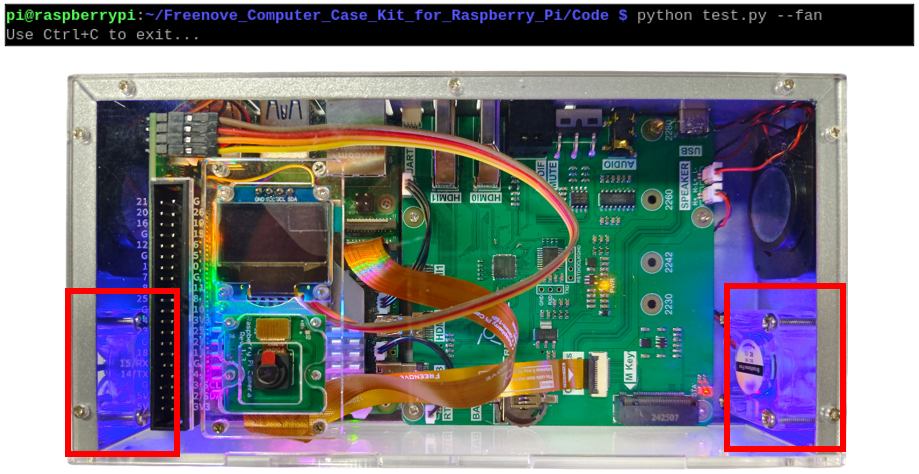
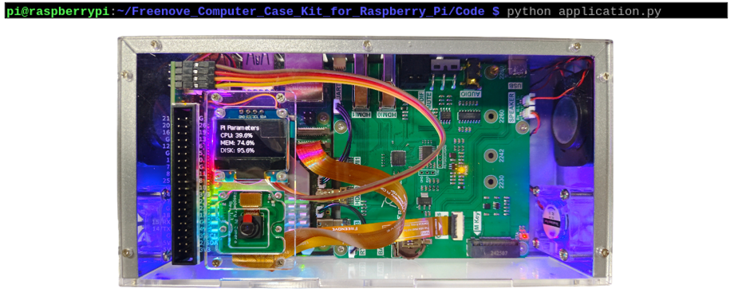

.. _Functionality_Tests:

##############################################################################
Chapter 4 Functionality Tests 
##############################################################################

.. raw:: html

   <iframe style="display: block; margin: 0 auto;" height="421.875" width="750" src="https://www.youtube.com/embed/v68T9gNt0eg" frameborder="0" allowfullscreen></iframe>

Before powering on the Freenove Computer Case for Raspberry Pi, please make sure that all cable connections are correct. Due to its multiple functions, this case requires an adequate power supply. We highly recommend using the official Raspberry Pi 5.1V / 5A power adapter (https://www.raspberrypi.com/products/27w-power-supply ). Failure to do so may result in the Freenove Computer Case for Raspberry Pi being unusable or causing damage to components.

4.1 Phenomena of a Successful Boot
*******************************************

If the computer case boots up successfully, you should see the following phenomena:

* On the Raspberry Pi 5, the STAT indicator light remains steadily lit in green. 

* On the Case Adapter Board:

- Both the PWR power indicator and the ON indicator are constantly illuminated. 

- The status indicator of the GPIO Board blinks intermittently, 

- The LED lights display a rainbow pattern. 

- The fans operate in adaptive mode, with their rotational speed adjusting automatically in response to temperature changes within the computer case.

If you have any questions of the above, please contact us at support@freenove.com

If you see the above results, then your computer case is correctly assembled and functioning well. At the point, you can connect a screen to your Raspberry Pi or access it via VNC viewer. 

4.2 Component Tests
*******************************************

Before we start the tests, we need to download the test code and install some necessary libraries.

Click Terminal

Run the following commands to obtain to code to your Raspberry Pi. After that, you can find the folder under the /home/pi directory.

You can also find and download the code in Raspberry Pi by visiting our official website 

(http://www.freenove.com) or our GitHub repository (https://github.com/freenove)

.. code-block:: console

    cd ~
    git clone https://github.com/Freenove/Freenove_Computer_Case_Kit_for_Raspberry_Pi.git

Run the following commands one by one to install the OLED library. Without it, the OLED screen may not work as expected.

First,update the Raspberry Pi system packages using apt.

.. code-block:: console

    sudo apt update 

Run the following commands one by one to install the OLED library. Without it, the OLED screen may not work as expected.

First,update the Raspberry Pi system packages using apt.

.. code-block:: console

    sudo apt update 

Second,install the OLED display library.

.. code-block:: console

    sudo apt install python3-luma.oled

As the GPIO Board and OLED screen are controlled via the RPi 5's IIC, we need to enable I2C on RPi 5. Run sudo raspi-config, select Interface Options -> I5 I2C -> Enter -> Yes -> OK.

4.2.1 LCD Screen Test
===================================

If your purchase is not an FNK0100H or FNK0100K, you can skip to the :ref:`next test. <HDMI_Test>`

When the Raspberry Pi 5 starts up, you can see the boot screen of the Raspberry Pi 5 on the monitor. If there is no display, please check whether the cables are connected correctly.

If you would like to learn more information about the display, you may click https://github.com/Freenove/Freenove_Touchscreen_Monitor_for_Raspberry_Pi

.. _HDMI_Test:

4.2.2 HDMI Test
======================================

If you have an HDMI screen yourself, you can connect it to the case with an HDMI cable.

4.2.3 Speaker Test
===================================

Before playing music, please check whether the speak switch is ON.

Open the data folder under the Freenove_Computer_Case_Kit_for_Raspberry_Pi/Code directory, and click the mp3 file to display.

4.2.4 Camera Test 
===================================

Enter the command :guilabel:`cd Freenove_Computer_Case_Kit_for_Raspberry_Pi/Code` to enter the directory where the test files are located.

Run :guilabel:`python test.py -h` to view the test command.

Run the following command to test the camera.

.. code-block:: console

    python test.py --camera

Press CTRL+C to exit the program.

4.2.5 OLED Test
=================================

Run the following code to test the OLED.

.. code-block:: console

    python test.py --oled

You should see the text displayed on it, as shown below. Press CTRL+C to exit the program.

4.2.6 Fan Test
=================================

Enter the following command to test the fans. The PWM duty cycles of the fans on both sides will gradually increase until they reach their maximum values, after which they will gradually decrease. Press Ctrl + C to exit once the testing is complete.

.. code-block:: console

    python test.py --fan

4.2.7 LED Test
================================

Enter the following code to test the LED lights. You can choose from different modes:

1. Static Mode: The LED lights display a single color, cycling through red - green - blue.

2. Following Mode: The LED lights will be lit one after another in sequence.

3. Breathing Mode: The brightness of the LED lights gradually increases and then gradually decreases.

4. Rainbow Mode: The LED lights display colors like a rainbow.

.. code-block:: console

    python test.py --led <mode:1-4>

The LED lights will work in the mode you choose. Please check whether they work as expected.

4.3 Overall Test
*********************************

If all components pass their tests, it indicates that they are all in good condition.

If you encounter any issues with them, please feel free to contact us at: support@freenove.com

You can test the overall functions of the computer case using the following command:

.. code-block:: console

    python application.py

All components will enter operational mode.  Here's what you can expect:

OLED Display: Automatically switches between different display contents.

LED Lights: Illuminate in rainbow mode.

Fans: Retrieves the PWM duty cycle from the Pi 5 CPU heatsink and automatically adjust their own PWM duty cycle based on the retrieved value.

.. note::
    
    If the fans do not start rotating, it may be due to the Pi 5 CPU active cooler not being activated. Please ensure that the active cooler is functioning correctly and is properly connected.

