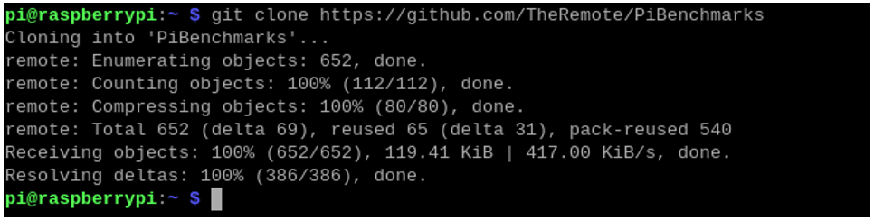
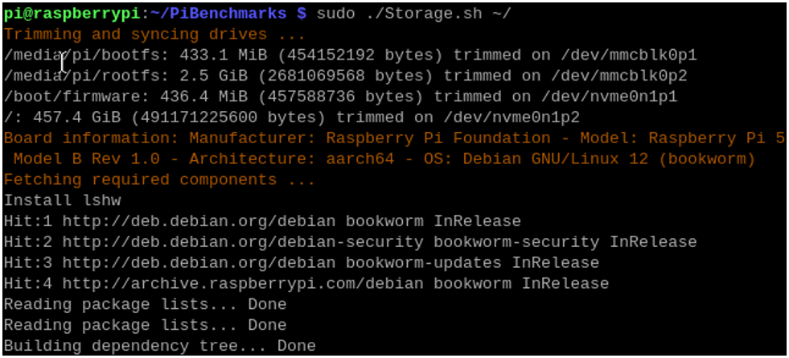
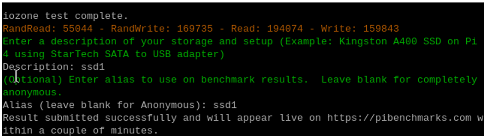
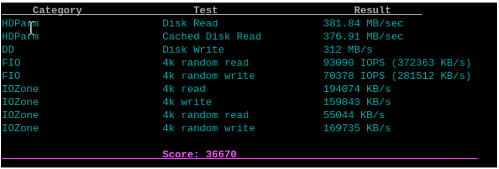
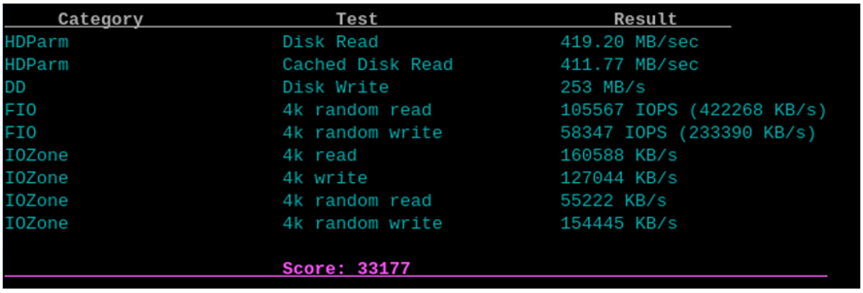
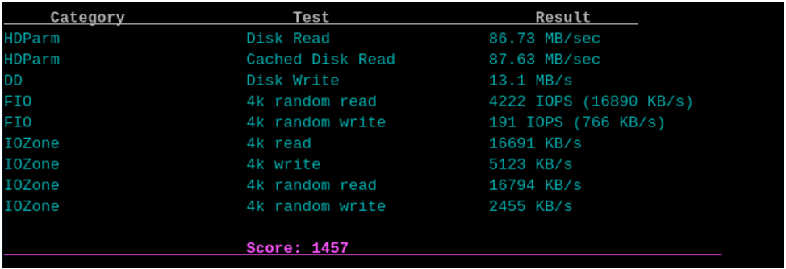
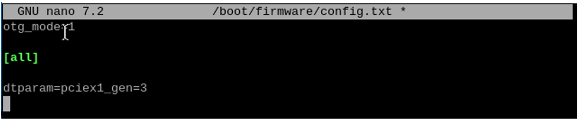
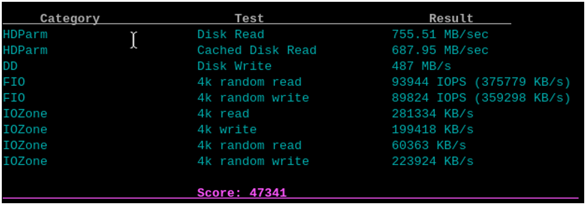
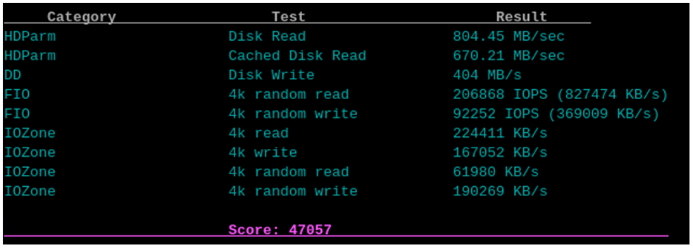

##############################################################################
Chapter 4 Speed Test & PCIe Gen3.0
##############################################################################

The Raspberry Pi 5 includes a PCIe x1 slot that is certified for PCIe Gen 2.0, providing a theoretical maximum throughput of 5GT/sec, which roughly translates to 500MB/sec for read and write operations. Although this slot is not officially certified for PCIe Gen 3.0, it is possible to force the use of Gen 3.0 for potentially higher speeds.

In actual tests, it is found that most SSDs can work stably at PCIE2.0, but are slightly unstable at PCIE3.0, while others are just the opposite. Therefore, please choose PCIE2.0 or PCIE3.0 according to your actual situation.

The PCIe consortium states that the speed of PCIe Gen 3.0 x1 is up to 8GT/sec, which translates to approximately 985MB/sec; however, Raspberry Pi claims that their implementation can achieve a speed of 10GT/sec, equivalent to around 1231MB/sec.

https://en.wikipedia.org/wiki/PCI_Express#Comparison_table

https://www.raspberrypi.com/documentation/computers/raspberry-pi.html#pcie-gen-3-0

4.1 Disk Speed Test
****************************

This is an additional chapter for those who wish to test the read and write speeds of their SSD.

Open the terminal and enter the following command:

.. code-block:: console
    
    git clone https://github.com/TheRemote/PiBenchmarks

Enter the directory:

.. code-block:: console
    
    cd PiBenchmarks/

Grant executable permissions to the script:

.. code-block:: console
    
    chmod +x Storage.sh

Start the speed test. Please be aware that the first execution will involve downloading the required dependencies, so the process could take a relatively long time.

.. code-block:: console
    
    sudo ./Storage.sh ~/

After the speed test is completed, follow the prompts to enter a description and a name for your SSD (you can use any arbitrary characters).

Test result:

The performance varies among different SSDs, and each test may have certain error, which is normal. The following image shows the speed test results for another SSD:

This is a speed test result for a TF (microSD) card, and it shows a significant difference in speed compared to an SSD.

4.2 PCIe Gen3.0
****************************

In the Preface, it is mentioned that the Raspberry Pi's PCIe Gen 3.0 has not been officially certified. While it is functional, its performance is not as reliable as desired. This chapter is presented as an exploratory section for assessing the speed capabilities of SSDs when used with PCIe Gen 3.0. For practical applications, it is advised to opt for PCIe Gen 2.0 to ensure greater stability and dependability.

Enable PCIe Gen3.0
===========================

Add the line ``dtparam=pciex1_gen=3`` to /boot/firmware/config.txt to enable PCIe Gen3.0.

As shown below, enter the command to open the file.

.. code-block:: console
    
    sudo nano /boot/firmware/config.txt

Add the line ``dtparam=pciex1_gen=3`` to the end of the file, as shown below:

Press Ctrl-O to save the file, Enter to confirm, and Ctrl-X to exit.

Reboot your Raspberry Pi.

.. code-block:: console
    
    sudo reboot

After rebooting, test the speed again.

The speed of another SSD.

Disable PCIe Gen3.0
===========================

Delete the line added with the previous step to disable PCIe Gen3.0.

Delete the line ``dtparam=pciex1_gen=3`` in the boot/firmware/config.txt file.

After the line is removed, it will change to PCIe Gen2.0.
