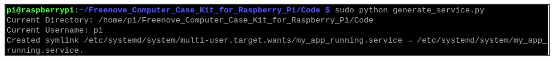

##############################################################################
Chapter 5 Auto Start Setting
##############################################################################

By now, you can start using your Raspberry Pi case. If you don't want to change to our configuration, :ref:`you can skip to the next chapter <Changing_Resolution>`.

You can set it to start up automatically by entering the following commands. After the settings are completed, when your Raspberry Pi 5 restarts, the OLED display and the case fans will run automatically.

5.1 Commands
**************************

Run the following commands to perform a one-click configuration for your Raspberry Pi 5. When the Raspberry Pi 5 boots up, the OLED display will automatically show some basic information about the Raspberry Pi 5. The GPIO Board will retrieve the PWM duty cycle of the Raspberry Pi 5's CPU active cooler and use it to set the PWM duty cycle of the case fans.

.. code-block:: console
    
    sudo python generate_service.py

If you've run this command, the subsequent commands are redundant as their functionality is already included. To configure them individually instead, use the commands below.

Execute the following command, and the OLED display will automatically show some basic information about the Raspberry Pi 5. Meanwhile, the GPIO Board will retrieve the PWM duty cycle of the Raspberry Pi 5's CPU active cooler and use it to set the PWM duty cycle of the case fans.

.. code-block:: console
    
    sudo systemctl start my_app_running.service

However, this won't configure your Raspberry Pi 5 to start these devices automatically when it boots up. As a result, when the Raspberry Pi 5 restarts, you'll still need to run the command again to start the OLED display and the case fans.

By running the following command, you can stop the OLED display and the case fan. If you have configured your Raspberry Pi 5 to start these devices automatically upon boot, the OLED screen and the case fans will start on their own when the Raspberry Pi restarts.

.. code-block:: console
    
    sudo systemctl stop my_app_running.service

Run the following command to configure your Raspberry Pi 5 to start the OLED display and the case fans automatically upon boot (use with caution).

.. code-block:: console
    
    sudo systemctl enable my_app_running.service

Run the following commands will disable the auto start of the OLED display and the case fans upon the Raspberry Pi 5 boots up (use with caution).

.. code-block:: console
    
    sudo systemctl disable my_app_running.service

5.2 Code Introduction
***********************************

By invoking different commands, you can set up one-click startup for your OLED display and case fans. Below are the codes:

.. literalinclude:: ../../../freenove_Kit/Code/generate_service.py
    :language: python
    :linenos:
    :dedent:

Import the feature modules and set whether to enable the DEBUG function.

.. literalinclude:: ../../../freenove_Kit/Code/generate_service.py
    :language: python
    :linenos:
    :lines: 1-6
    :dedent:

Step 1: Check if application.py exists

.. literalinclude:: ../../../freenove_Kit/Code/generate_service.py
    :language: python
    :linenos:
    :lines: 81-83
    :dedent:

Step 2: Get the current directory.

.. literalinclude:: ../../../freenove_Kit/Code/generate_service.py
    :language: python
    :linenos:
    :lines: 85-86
    :dedent:

Step 3: Pass the current path as a parameter into the function, retrieve the current username under that path, and print both the current path and the username.

.. literalinclude:: ../../../freenove_Kit/Code/generate_service.py
    :language: python
    :linenos:
    :lines: 88-92
    :dedent:

Step 4: Create an app running service using the current path parameter and the username parameter.

.. literalinclude:: ../../../freenove_Kit/Code/generate_service.py
    :language: python
    :linenos:
    :lines: 94-95
    :dedent:

Step 5: Run system commands.

.. literalinclude:: ../../../freenove_Kit/Code/generate_service.py
    :language: python
    :linenos:
    :lines: 97-99
    :dedent:

Step 6: Enable the app running service and set your device to start automatically on boot.

.. literalinclude:: ../../../freenove_Kit/Code/generate_service.py
    :language: python
    :linenos:
    :lines: 101-103
    :dedent:

Step 7: Start your device.

.. literalinclude:: ../../../freenove_Kit/Code/generate_service.py
    :language: python
    :linenos:
    :lines: 115-117
    :dedent:

Finally, delete the __pycache__ folder.

.. literalinclude:: ../../../freenove_Kit/Code/generate_service.py
    :language: python
    :linenos:
    :lines: 119-119
    :dedent:

Reference
---------------------------

.. py:function:: def check_application_py(filenanme="application.py"):

    Check if application.py exists 
    
    **Parameters**
    
        **filename:** name of the file, in string type, which is "application.py” by default

.. py:function:: def get_current_directory():

    Step 2: Get the current directory.

.. py:function:: def get_current_username_from_directory(directory):

    Get username under the current directory
    
    Parameters
    
    directory: retrieve from the path

.. py:function:: def create_my_app_running_service(directory, username):

    Create an app running service using the current path. 
    
    **Parameters**
    
        **directory:** under the current directory
    
        **username:** username

.. py:function:: def run_system_command(command):

    Run system commands

    **Parameters**
    
        **command:** system command, in string type

.. py:function:: def remove_pycache_folder(directory):

    Remove the _pycache_ folder。

    **Parameters**
        
        **directory:** the _pycache_ folder under the current directory