.. _Changing_Resolution:

##############################################################################
Chapter 6 Changing Resolution
##############################################################################

If your purchase is FNK0100A or FNK0100B, you can skip to :ref:`the next chapter <Communication_Protocols_and_Controls>`.

The FNK0100H and FNK0100K features a display with a resolution of 800x480. When the Raspberry Pi 5 boots up, it creates two display areas: DSI-1 and HDMI-A-1, which have different resolutions. This mismatch will cause two issues:  

1. VNC Connection: You will see no content in the VNC window because VNC mirrors the HDMI-A-1 area, which may not match the display configuration.  

2. Touch Control: You cannot control the HDMI-A-1 interface via touch on the computer case's display.  

Solution: Overlap the two display areas and adjust the resolution of HDMI-A-1 to match the screen (800×480).

6.1 Overlapping Displaying Area
*****************************************

Do as following to overlap the display areas of DSI-1 and HDMI-A-1.

Click on the screen: applications menu -> Preferences -> Screen Configuration.

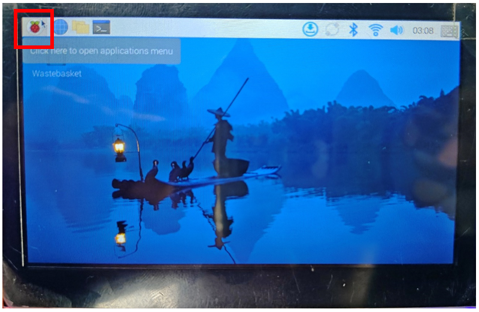

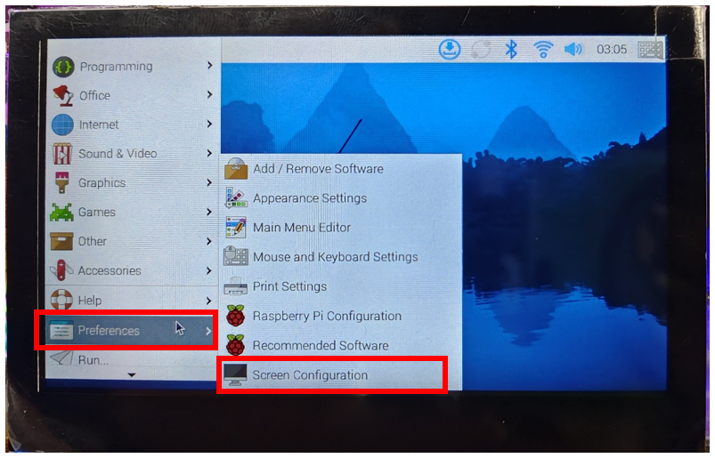

Overlap the two areas and click Apply -> OK.

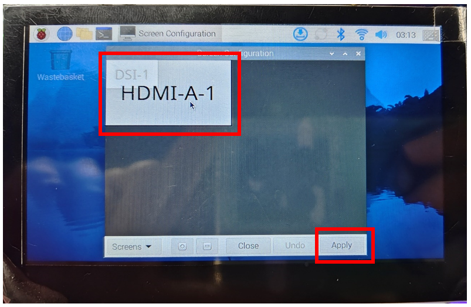

6.2 Adding Resolution Option
****************************************

After overlapping, due to their different resolutions, the HDMI-A-1display area will be larger, causing the VNC display to show uneven or mismatched regions. Additionally, there is no 800×480 resolution option available for HDMI-A-1.

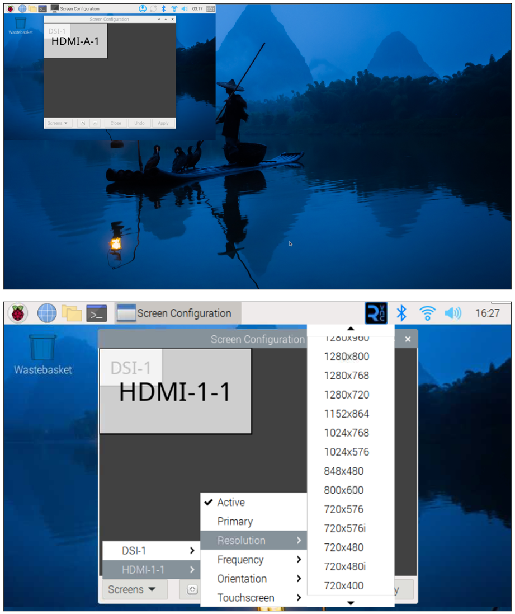

To configure the HDMI-A-1 with the same resolution (800x480) as that of DSI-1, we need to add a resolution option for HDMI-A-1 with the following steps:

Open Terminal:

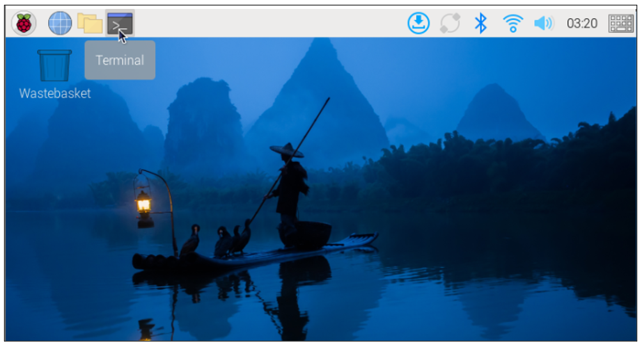

Run the following command:

.. code-block::
    
    sudo nano /boot/firmware/cmdline.txt

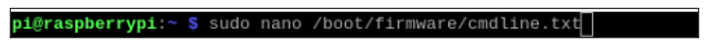

Put the following parameter (video=HDMI-A-1:800x480@60) on the same line with other parameters, separated with a space. Do not use newlines. Press Ctrl+S to save and Ctrl+X to exit. Then, restart your system (a restart is mandatory for the changes to take effect). Alternatively, you can manually adjust the resolution as needed.

https://www.raspberrypi.com/documentation/computers/configuration.html#kernel-command-line-cmdline-txt

.. code-block::
    
    video=HDMI-A-1:800x480@60

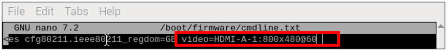

After rebooting, configure the resolution for HDMI-A-1. Select Screens -> HDMI-A-1 -> Resolution -> 800x480 -> Apply -> OK.

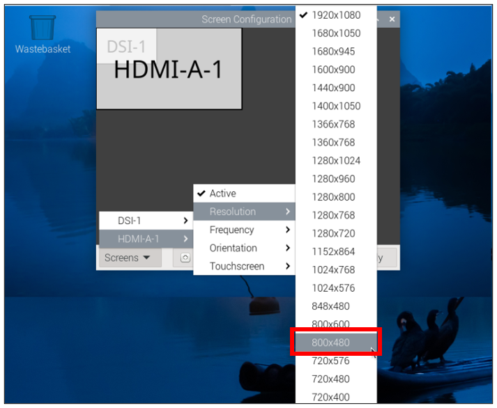

After the configuration, you can see that the display area of HDMI-A-1 is the same as that of DSI-1.

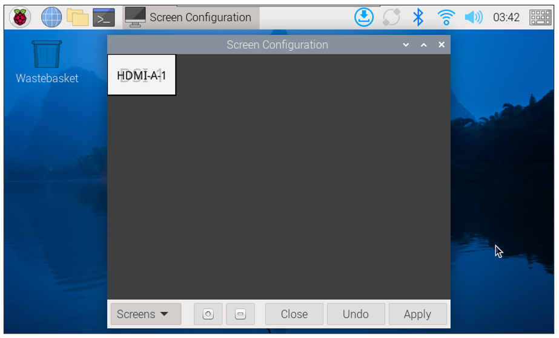

6.3 Installing Full Version of VNC Server
**********************************************

The built-in VNC server on the Raspberry Pi is limited in functionality, and you may experience connection issues after completing the previous steps. To access advanced features such as bidirectional file transfer, clipboard sharing, and more, it is strongly recommended to install the full version of VNC Server. Please enter the following command to install it:

.. code-block:: console
    
    sudo apt-get install realvnc-vnc-server

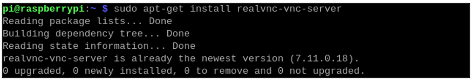

Run the following command to restart VNC service and restart VNC interface.

.. code-block:: console

    sudo systemctl restart vncserver-x11-serviced

Run :guilabel:`sudo raspi-config`, select Advanced Options -> A6 Wayland-> W1 X11-> Enter -> OK.

:combo:`red font-bolder:(Note: The “Wayland” option order may vary among different versions of Raspberry PI OS.)`

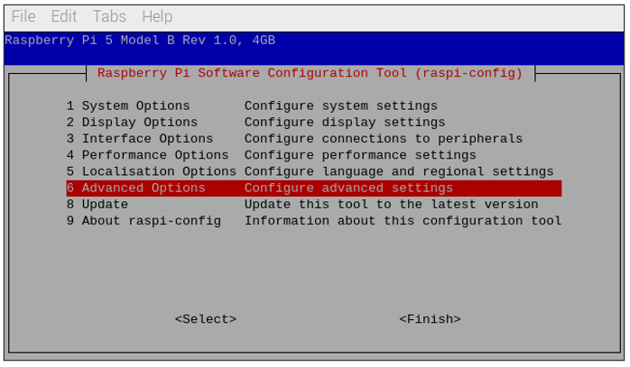

Select Advanced Options -> A7 Audio Config -> 1 PulseAudio -> Enter -> OK.

:combo:`red font-bolder:(Note: The “Audio Config” option order may vary among different versions of Raspberry PI OS.)`

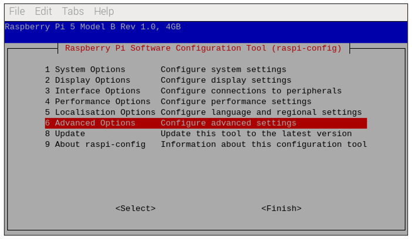

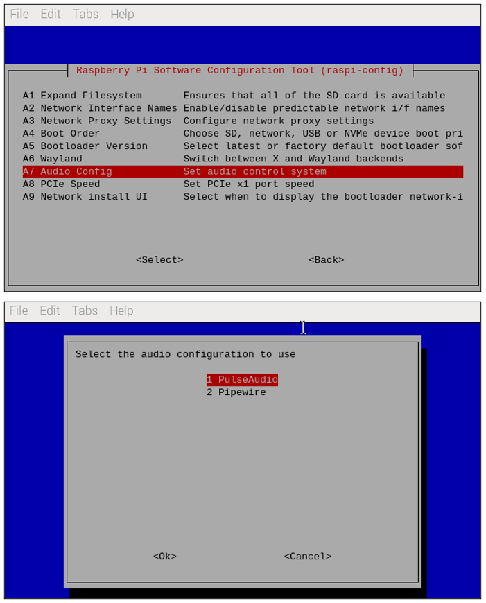

Open the Terminal on your computer. Run the following command to ssh to your Pi.

.. code-block:: console
    
    ssh pi@192.168.1.147

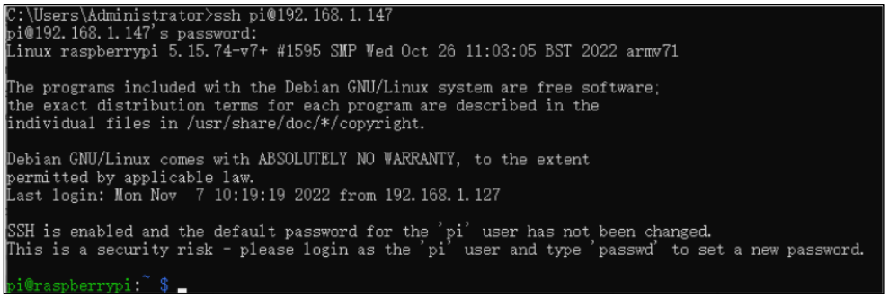

Enter the following command: select Interface Options -> I3 VNC -> Enter -> Yes -> OK, and then open the VNC viewer.

.. code-block:: console
    
    sudo raspi-config

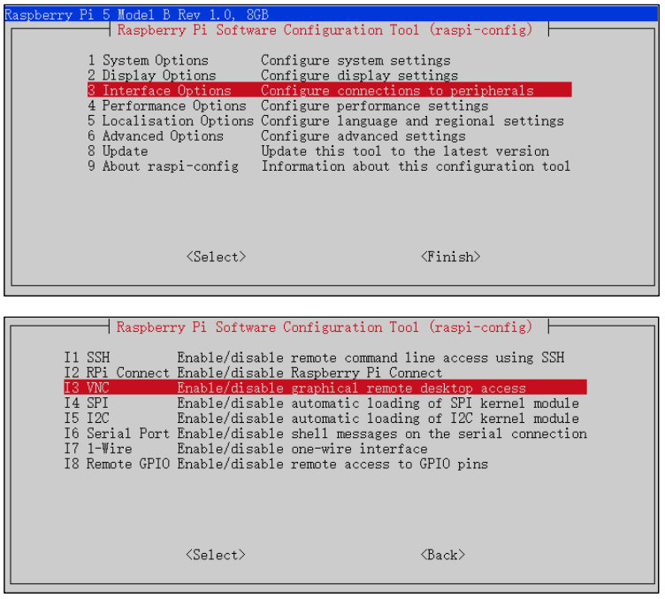

Enabling W1 X11 may cause a gray screen in VNC viewer after restarting. We will need to manually restart the VNC service. Open the VNC interface, click on the menu, and navigate toPreferences -> Control Centre -> Interfaces.

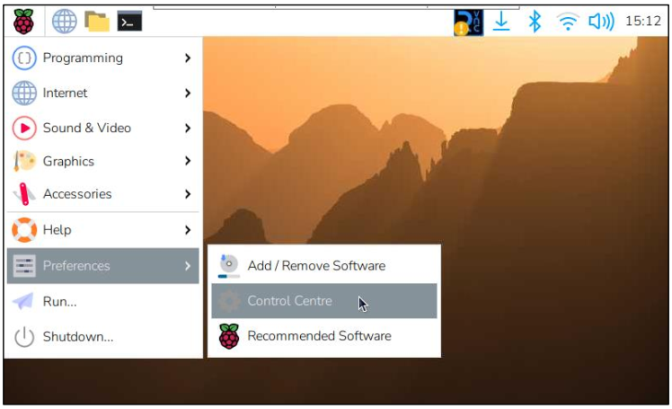

Click to turn off the VNC service.

.. image:: ../_static/imgs/6_Changing_Resolution/Chapter06_21.png
    :align: center

ssh into your Raspberry Pi to enable VNC again via the computer terminal, enter the following command: select Interface Options -> I3 VNC -> Enter -> Yes -> OK, and then open the VNC viewer.

.. code-block:: console
    
    sudo raspi-config

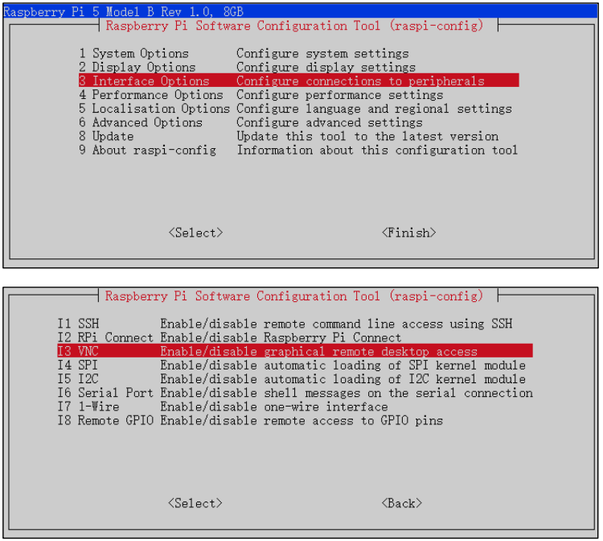

Click to start the VNC service.

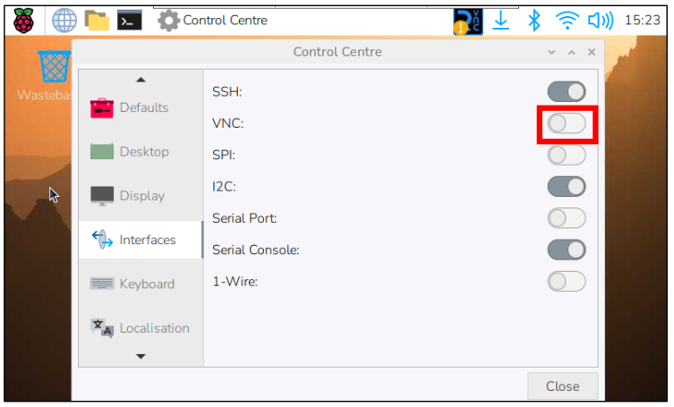

Once you see the VNC icon in the status bar, it indicates that the full version of the VNC service has been successfully installed and is running.

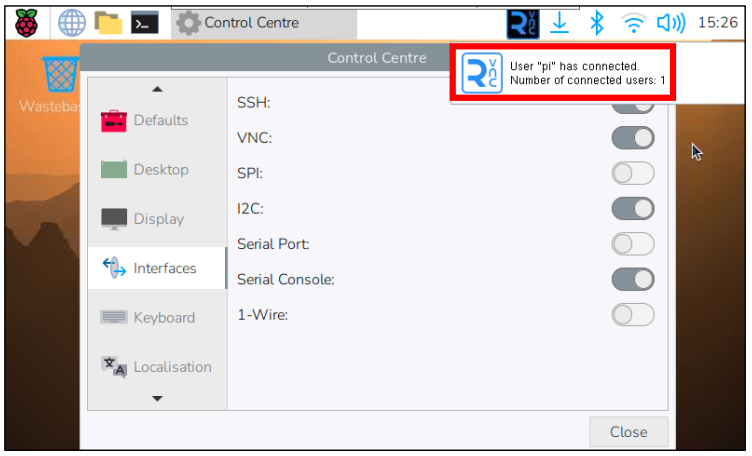

6.4 Restart HDMI 
*******************************

Activate HDMI again. Click Preferences -> Screen Configuration.

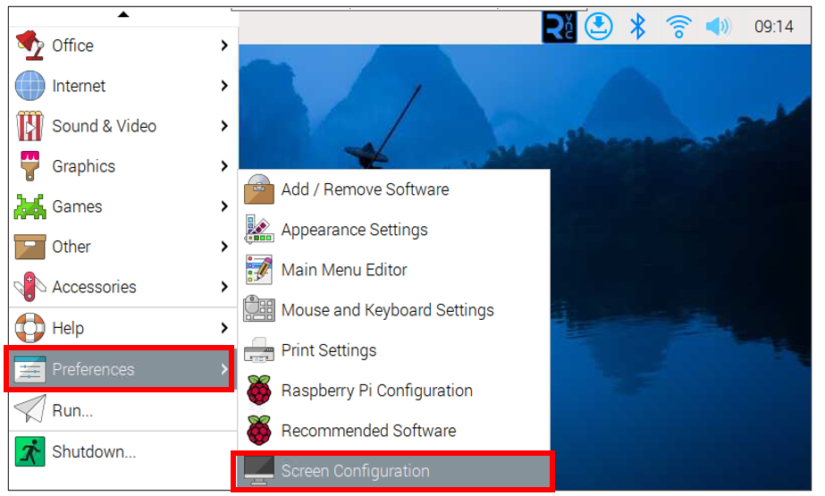

Select Screen -> HDMI-1-1 -> Active.

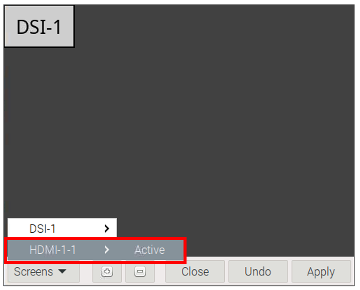

Select Screen -> HDMI-1-1 -> Resolution -> 800x480.

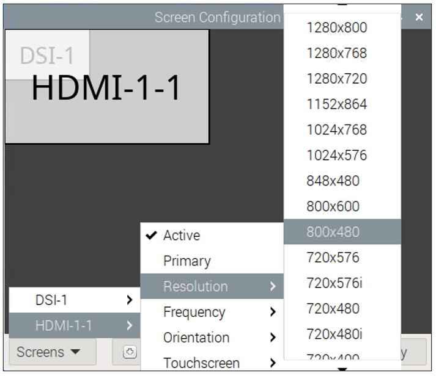