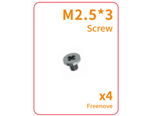
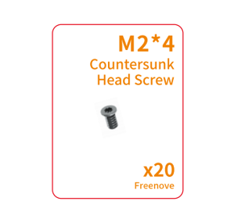

##############################################################################
List
##############################################################################

This product is currently available in four versions: FNK0100A, FNK0100B, FNK0100H, and FNK0100K.

Among them,

FNK0100A is the basic model;

FNK0100H & FNK0100K: Include a 4.3-inch IPS screen (with a DSI interface)

FNK0100B & FNK0100K: Come with an NVMe SSD.

Below are their respective images:

.. table::
    :align: center
    :class: table-line
    :width: 90%

    +-----------+
    | FNK0100A: |
    |           |
    | |List00|  |
    +-----------+
    | FNK0100B: |
    |           |
    | |List01|  |
    +-----------+
    | FNK0100H: |
    |           |
    | |List02|  |
    +-----------+
    | FNK0100K: |
    |           |
    | |List03|  |
    +-----------+

Before getting started, please check the part list. If any component is missing from your kit, please email our support team at

support@freenove.com

Metal Case
***********************

.. table::
    :align: center
    :class: table-line
    :width: 90%

    +----------------+
    | Metal case x 1 |
    |                |
    | |List04|       |
    +----------------+

Machinery Parts
***********************

All fasteners come in a larger bag, please open it and check whether they are complete.

.. table::
    :align: center
    :class: table-line
    :width: 90%

    +------------------------------------------------------------------------------------------+-------------------------------------------------------------------------------------------+-----------------------------------------------------------+
    | |List05|                                                                                 | |List06|                                                                                  | |List07|                                                  |
    +------------------------------------------------------------------------------------------+-------------------------------------------------------------------------------------------+-----------------------------------------------------------+
    | :combo:`red font-bolder:Note: Screws may be supplied in either left or right quantities.`| :combo:`red font-bolder:Note: Screws may be supplied in either left or right quantities.` | :combo:`red font-bolder:(Only for FNK0100H and FNK0100K)` |
    |                                                                                          |                                                                                           |                                                           |
    | |List08|                                                                                 | |List09|                                                                                  | |List10|                                                  |
    +------------------------------------------------------------------------------------------+-------------------------------------------------------------------------------------------+-----------------------------------------------------------+
    | :combo:`red font-bolder:(Only for FNK0100A and FNK0100B)`                                | :combo:`red font-bolder:(Only for FNK0100H and FNK0100K)`                                 |                                                           |
    |                                                                                          |                                                                                           |                                                           |
    | |List11|                                                                                 | |List12|                                                                                  |                                                           |
    +------------------------------------------------------------------------------------------+-------------------------------------------------------------------------------------------+-----------------------------------------------------------+

.. |List07| image:: ../_static/imgs/List/List07.png

Acrylic Parts
***********************

.. table::
    :align: center
    :class: table-line
    :width: 90%

    +-------------------------------------------------------------------------------------------------------------+
    | Top Cover x 1 :red:`(Only for FNK0100A and FNK0100B)`                                                       |
    |                                                                                                             |
    | |List13|                                                                                                    |
    +-------------------------------------------------------------------------------------------------------------+
    | Top Cover X 1, Support Plate for Screen X 1 :red:`(Only for FNK0100H and FNK0100K)`                         |
    |                                                                                                             |
    | |List14|                                                                                                    |
    +-------------------------------------------------------------------------------------------------------------+
    | Side Plate x 1                                                                                              |
    |                                                                                                             |
    | |List15|                                                                                                    |
    +-------------------------------------------------------------------------------------------------------------+
    | Acrylic Part for OLED Screen and Camera x 1                                                                 |
    |                                                                                                             |
    | |List17|                                                                                                    |
    +------------------------------------------------------+------------------------------------------------------+
    | Power Button Caps x 6                                | Speaker acrylic pad x 2                              |
    |                                                      |                                                      |
    | |List16|                                             | |List38|                                             |
    |                                                      |                                                      |
    | :red:`Note: The physical power button caps are very` |                                                      |
    |                                                      |                                                      |
    | :red:`small, so be careful not to lose them.`        |                                                      |
    +------------------------------------------------------+------------------------------------------------------+

.. |List16| image:: ../_static/imgs/List/List16.png

.. |List38| image:: ../_static/imgs/List/List38.png

Electronic Parts
***********************

Freenove Case Adapter for Raspberry Pi
==============================================

.. table::
    :align: center
    :class: table-line
    :width: 90%

    +----------+----------+
    | Top      | Bottom   |
    |          |          |
    | |List18| | |List19| |
    +----------+----------+

Freenove Case GPIO Adapter for Raspberry Pi
===============================================

.. table::
    :align: center
    :class: table-line
    :width: 90%

    +----------+----------+
    | Top      | Bottom   |
    |          |          |
    | |List20| | |List21| |
    +----------+----------+

Electronic Modules
===============================================

.. table::
    :align: center
    :class: table-line
    :width: 90%

    +---------------------------------------------------------------------+---------------------------------------------------------------------+
    | Camera Module x 1                                                   | OLED Module x 1                                                     |
    |                                                                     |                                                                     |
    | |List22|                                                            | |List23|                                                            |
    +---------------------------------------------------------------------+---------------------------------------------------------------------+
    | 3010 Fan x 2                                                        | 3040 Speaker x 2                                                    |
    |                                                                     |                                                                     |
    | |List24|                                                            | |List25|                                                            |
    +---------------------------------------------------------------------+---------------------------------------------------------------------+
    | 4.3-inch Screen (with 3 FPC lines) x 1 :red:`(Only for FNK0100H and FNK0100K)`                                                            |
    |                                                                                                                                           |
    | |List26|                                                                                                                                  |
    |                                                                                                                                           |
    | :red:`Caution: Although the Raspberry Pi camera cable and screen cable may look identical in appearance, they are NOT interchangeable.`   |
    +---------------------------------------------------------------------+---------------------------------------------------------------------+
    | Pi5 CPU Active Cooler x 1, Heat Dissipation Silicone Sheet x3                                                                             |
    |                                                                                                                                           |
    | |List27|                                                                                                                                  |
    +---------------------------------------------------------------------+---------------------------------------------------------------------+
    | NVMe SSD x 1 :red:`(Only for FNK0100B and FNK0100K)`                                                                                      |
    |                                                                                                                                           |
    | |List28|                                                                                                                                  |
    +---------------------------------------------------------------------+---------------------------------------------------------------------+

Wires
***********************************

.. table::
    :align: center
    :class: table-line
    :width: 90%

    +-----------------------------------------------------------------------------------------------------------------------------------------+
    | F-F Jumper Wire -4P-20cm x 1                                                                                                            |
    |                                                                                                                                         |
    | |List29|                                                                                                                                |
    +-----------------------------------------------------------------------------------------------------------------------------------------+
    | NVMe SSD FPC Line-0.5mm-16P-12cm (same direction) x 1                                                                                   |
    |                                                                                                                                         |
    | |List30|                                                                                                                                |
    +-----------------------------------------------------------------------------------------------------------------------------------------+
    | SH-1.0mm-2P-5cm cable (same direction) x 1                                                                                              |
    |                                                                                                                                         |
    | |List31|                                                                                                                                |
    +-----------------------------------------------------------------------------------------------------------------------------------------+
    | SH-1.0mm-3P-5cm cable (same direction) x 1                                                                                              |
    |                                                                                                                                         |
    | |List32|                                                                                                                                |
    +-----------------------------------------------------------------------------------------------------------------------------------------+
    | Camera FPC line 0.5mm-22P to 1.0mm-15P-16cm line (same direction) x 1                                                                   |
    |                                                                                                                                         |
    | |List33|                                                                                                                                |
    |                                                                                                                                         |
    | :red:`Caution: Although the Raspberry Pi camera cable and screen cable may look identical in appearance, they are NOT interchangeable.` |
    +-----------------------------------------------------------------------------------------------------------------------------------------+

Tools
***********************************

.. table::
    :align: center
    :class: table-line
    :width: 90%

    +-----------------------------------------------------------------------------------------------------------------------------------------+
    | Cross screwdriver (3mm) x 1                                                                                                             |
    |                                                                                                                                         |
    | |List34|                                                                                                                                |
    +-----------------------------------------------------------------------------------------------------------------------------------------+

.. |List34| image:: ../_static/imgs/List/List34.png

Required but NOT Contained Parts
*********************************************

.. table::
    :align: center
    :class: table-line
    :width: 90%

    +--------------------------------------------------------------------------------------------------------------------+
    | Raspberry Pi 5 x 1                                                                                                 |
    |                                                                                                                    |
    | |List35|                                                                                                           |
    +--------------------------------------------------------------------------------------------------------------------+
    | 27W Power Adapter x 1 :red:`(or a power adapter compatible with Raspberry Pi official one that can output 5.1V/5A)`|
    |                                                                                                                    |
    | |List36|                                                                                                           |
    +--------------------------------------------------------------------------------------------------------------------+
    | Micro SD Card (TF Card), Card Reader x 1                                                                           |
    |                                                                                                                    |
    | |List37|                                                                                                           |
    +--------------------------------------------------------------------------------------------------------------------+

